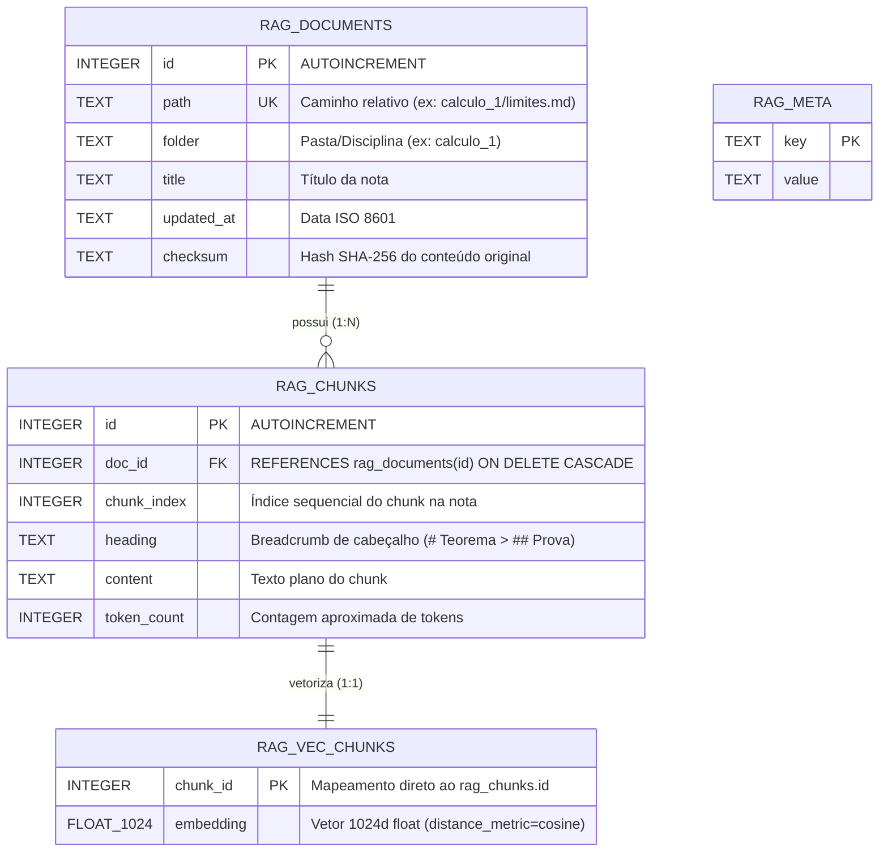

# Plano de Implementação — Fase B: RAG sobre Notas de Estudo (Obsidian .md)

Documento técnico de arquitetura, contratos e plano de execução para a Fase B do projeto nanobot: indexação semântica, vetorização local via `sqlite-vec`, reranking e recuperação de notas de estudo da faculdade.

---

## 1. Goal Description

Implementar um pipeline local, determinístico e auditável de RAG (Retrieval-Augmented Generation) sobre o vault de notas de estudo em Markdown (`nanobot-workspace/faculdade/`), integrando:
1. **Parser & Chunker de Markdown/Obsidian**: chunking de 1 nota = 1 chunk para notas de até ~1500 tokens, com fallback de particionamento hierárquico por seções (`#`, `##`, `###`) e parágrafos mantendo breadcrumbs de contexto, ignorando arquivos `*.sync-conflict-*.md`.
2. **Armazenamento Vetorial & Metadados (`sqlite-vec`)**: banco SQLite local utilizando a extensão C `sqlite-vec` (`vec0`) em modo WAL, armazenando metadados ricos (caminho, pasta/disciplina, título, data, checksum SHA-256) e vetores normalizados de 1024 dimensões.
3. **Pipeline de Inferência Local**:
   - Geração de embeddings via `llama-server` local em `http://127.0.0.1:8082/v1/embeddings` (`Qwen3-Embedding-0.6B-Q8_0`, porta 8082).
   - Reranking dos candidatos top-k (k=10) via `llama-server --rerank` em `http://127.0.0.1:8081/v1/rerank` (`Qwen3-Reranker-0.6B-Q8_0`, porta 8081).
   - Geração/resposta via `llama-server` em `http://127.0.0.1:8080/v1` (`Qwen3.5-9B`, porta 8080).
   - Filtro por threshold de relevância configurável (~0.5 inicial).
4. **Ferramenta do Agente (`search_study_notes`)**: ferramenta nativa registrada no `ToolRegistry` permitindo ao agente pesquisar notas com metadados e citações precisas.
5. **CLI de Sincronização & Inspeção (`nanobot rag`)**: subcomandos Typer para indexação incremental, status da base e busca direta de diagnóstico.
6. **Atualização de Governança (`GEMINI.md`)**: reconciliação da Seção 8 de skills (`planning` unificada, `independent-review`, `test-driven-development`, `top-web-vulnerabilities`, `local-llm-serving`).

---

## 2. Decisões de Fronteira e Isolamento

> [!IMPORTANT]
> **Isolamento do Banco SQLite vs. Syncthing**:
> As notas da faculdade são sincronizadas pelo Syncthing (`22000/tcp, udp`). Para evitar conflitos de sincronização e corrupção de arquivos em mutação constante (`.db`, `.db-wal`, `.db-shm`), o banco SQLite **não residirá na pasta sincronizada de notas**. Ele será gravado no diretório de dados do nanobot: `~/.nanobot/data/rag.db` (ou `workspace/.rag/rag.db` com `.stignore` obrigatório).

> [!IMPORTANT]
> **Sincronização de Dependências no Usuário de Serviço (`nanobot-svc`)**:
> Conforme auditado no [Relatório de Auditoria](file:///home/cleiton/opencode/nanobot/docs/audits/2026-08-24-empirical-audit.md), a conta `nanobot-svc` possui um virtualenv isolado em `/home/nanobot-svc/.venv/`. O pacote `sqlite-vec` precisará ser instalado no ambiente de desenvolvimento (`cleiton`) e no ambiente de produção (`nanobot-svc`), com validação explícita de `__file__` e UID conforme a Regra 7 e 9 do `GEMINI.md` (sem `NOPASSWD`).

---

## 3. Arquitetura e Decisões de Rigor

### A. Topologia de Servidores e Portas Confirmada Empiricamente

| Serviço   | Porta | Modelo                           | Endpoint / Flags                              |
| --------- | ----- | -------------------------------- | --------------------------------------------- |
| Geração   | 8080  | `Qwen3.5-9B-Q5_K_M.gguf`         | `http://127.0.0.1:8080/v1` (`-c 16384`)       |
| Reranker  | 8081  | `qwen3-reranker-0.6b-q8_0.gguf`  | `http://127.0.0.1:8081/v1/rerank` (`--rerank`)|
| Embedding | 8082  | `Qwen3-Embedding-0.6B-Q8_0.gguf` | `http://127.0.0.1:8082/v1/embeddings` (`--embedding --pooling mean`)|

---

### B. Esquema Relacional & Vetorial SQLite (`nanobot/rag/store.py`)



#### Justificativa dos Campos, Índices e Concorrência:
- `rag_documents.path` (`UNIQUE`): chave natural de identificação do arquivo no vault; garante idempotência na indexação incremental e detecção de arquivos renomeados/deletados.
- `rag_documents.checksum`: hash SHA-256 para o fast-path de sincronização — se o `mtime` mudou mas o checksum for idêntico, evita re-vetorização desnecessária.
- `rag_chunks.UNIQUE(doc_id, chunk_index)`: impede duplicação de fragmentos em caso de reexecução parcial.
- `rag_vec_chunks` (`vec0` virtual table): o `chunk_id` integer atua como chave primária vinculada ao `rag_chunks.id`.
- `PRAGMA journal_mode=WAL` e `PRAGMA busy_timeout=5000`: garante concorrência segura entre consultas da Tool e sincronizações CLI sem erro de `database is locked`.
- **Dinamismo de Dimensão**: A dimensão padrão é `1024` (confirmada empiricamente no `Qwen3-Embedding-0.6B-Q8_0`). A tabela `rag_meta` registra a dimensão e o modelo ativo; caso o modelo mude no futuro (ex.: upgrade condicional para `4B` com 2560 dimensões), o `RagStore` detecta a incompatibilidade e recria o índice de forma controlada.

---

### C. Estratégia de Chunking e Tokenização (`nanobot/rag/markdown.py`)

- **Mecanismo de Tokenização (Rigor)**:
  - O particionamento em nível de arquivo utiliza `tiktoken` (`cl100k_base`) como **estimativa heurística rápida de pré-particionamento**. Como o `cl100k_base` difere do vocabulário nativo do Qwen (151.643 tokens), essa contagem possui margem de divergência não quantificada. Por isso, adota-se um teto conservador de 1500 tokens.
  - Para contagem exata quando o `llama-server` estiver ativo, o cliente consulta o endpoint local `POST http://127.0.0.1:8080/tokenize`.
- **Estratégia de Chunking**:
  1. Extração resiliente de frontmatter YAML (se malformado, fallback para a primeira linha `# H1` sem abortar o sync).
  2. Sanitização de `[[Wikilinks|Alias]]` para texto plano legível (`Alias`).
  3. **Filtro Syncthing**: Ignorar explicitamente arquivos de conflito do padrão `*.sync-conflict-*.md`.
  4. Se `tokens <= 1500`: **1 nota = 1 chunk** íntegro.
  5. Se `tokens > 1500`: split hierárquico por seções markdown (`#`, `##`, `###`), preservando breadcrumbs (`[Nota: Cálculo 1 > Limites > Teorema do Confronto]`).
  6. Se uma seção individual exceder 1500 tokens: split por parágrafos (`\n\n`) com overlap de ~100 tokens.

---

### D. Pipeline de Recuperação, Batching e Reranking

- **Batching de Embeddings**: As chamadas ao endpoint `POST http://127.0.0.1:8082/v1/embeddings` são particionadas em lotes de 16 a 32 chunks, prevenindo estouro de buffer e limites de requisição.
- **Reranker com Curto-Circuito**:
  - Consulta `POST http://127.0.0.1:8081/v1/rerank` com payload `{"model": ..., "query": ..., "documents": [...], "top_n": 10}`.
  - Curto-circuito: se o KNN retornar 0 chunks, o cliente não dispara o request HTTP ao reranker (evitando erro 400).
  - Filtro: descarta chunks com `relevance_score < score_threshold` (default 0.5) e ordena os resultados remanescentes por score decrescente.

---

## 4. Proposed Changes

### Componente 1: Dependências & Config Schema
---

#### [MODIFY] [pyproject.toml](file:///home/cleiton/opencode/nanobot/pyproject.toml)
- Adicionar `sqlite-vec>=0.1.6,<0.2.0` à lista de `dependencies` (auditado: MIT/Apache dual license, CVE-2024-46488 mitigado a partir de 0.1.3).

#### [MODIFY] [nanobot/config/schema.py](file:///home/cleiton/opencode/nanobot/nanobot/config/schema.py)
- Definir `StudyRagConfig(Base)` com as opções:
  - `enable: bool = True`
  - `notes_dir: str = "faculdade"`
  - `db_path: str = "~/.nanobot/data/rag.db"`
  - `embedding_url: str = "http://127.0.0.1:8082/v1/embeddings"` *(Porta 8082 confirmada)*
  - `embedding_model: str = "Qwen3-Embedding-0.6B-Q8_0.gguf"`
  - `embedding_dims: int = 1024` *(Dimensão 1024 confirmada empiricamente)*
  - `reranker_url: str = "http://127.0.0.1:8081/v1/rerank"`
  - `reranker_model: str = "ggml-org/Qwen3-Reranker-0.6B-Q8_0-GGUF"`
  - `top_k: int = 10`
  - `score_threshold: float = 0.5`
  - `chunk_max_tokens: int = 1500`
- Adicionar campo `rag: StudyRagConfig` em `ToolsConfig` com `_lazy_default("nanobot.agent.tools.rag", "StudyRagConfig")`.
- Atualizar `_resolve_tool_config_refs()` para importar `StudyRagConfig` e invocar `ToolsConfig.model_rebuild()`.

---

### Componente 2: Módulo Core de RAG (`nanobot/rag/`)
---

#### [NEW] [nanobot/rag/__init__.py](file:///home/cleiton/opencode/nanobot/nanobot/rag/__init__.py)
- Exportar classes públicas: `MarkdownParser`, `RagStore`, `EmbeddingClient`, `RerankerClient`, `RagService`.

#### [NEW] [nanobot/rag/markdown.py](file:///home/cleiton/opencode/nanobot/nanobot/rag/markdown.py)
- Extração de frontmatter YAML resiliente.
- Sanitização de wikilinks e descarte de arquivos `*.sync-conflict-*.md`.
- Algoritmo de chunking: 1 nota = 1 chunk se <= 1500 tokens, split por headings com breadcrumbs e split adicional por parágrafos com overlap se necessário.
- Cálculo de SHA-256 e contagem de tokens com tiktoken / `/tokenize`.

#### [NEW] [nanobot/rag/store.py](file:///home/cleiton/opencode/nanobot/nanobot/rag/store.py)
- Inicialização do SQLite com `sqlite_vec.load(db)`.
- Configuração de `PRAGMA journal_mode=WAL` e `PRAGMA busy_timeout=5000`.
- Criação das tabelas `rag_documents`, `rag_chunks`, `rag_meta` e virtual table `rag_vec_chunks` (`vec0` com 1024 dims).
- Operações atômicas com `BEGIN IMMEDIATE`: `upsert_document()`, `delete_document()`, `get_document_by_path()`, `list_documents()`.
- Busca vetorial KNN com junção relacional e filtro de pasta opcional.

#### [NEW] [nanobot/rag/clients.py](file:///home/cleiton/opencode/nanobot/nanobot/rag/clients.py)
- `EmbeddingClient`: chamadas assíncronas a `http://127.0.0.1:8082/v1/embeddings` em lotes (16 a 32 chunks) com validação de dimensões e suporte a `/tokenize`.
- `RerankerClient`: chamadas assíncronas a `http://127.0.0.1:8081/v1/rerank`, mapeamento de índices, filtro de `score_threshold` e proteção contra lista vazia.

#### [NEW] [nanobot/rag/service.py](file:///home/cleiton/opencode/nanobot/nanobot/rag/service.py)
- Orquestrador de alto nível:
  - `sync_notes(force: bool = False) -> SyncStats`: varredura incremental de `.md` (ignorando `*.sync-conflict-*.md`), deleção de notas removidas, batch embedding de notas novas/modificadas.
  - `search(query: str, folder: str | None = None, top_k: int | None = None) -> list[RagResult]`: fluxo completo embed -> KNN -> rerank -> threshold.

---

### Componente 3: Ferramenta do Agente & CLI
---

#### [NEW] [nanobot/agent/tools/rag.py](file:///home/cleiton/opencode/nanobot/nanobot/agent/tools/rag.py)
- Implementação de `SearchStudyNotesTool` herdando de `Tool`.
- Decorador `@tool_parameters` com schema JSON estrito (`query` [string, req], `folder` [string, opt], `top_k` [int, opt]).
- Propriedades `read_only = True`, `concurrency_safe = True`.
- Formatação clara em Markdown das notas recuperadas com referências e pontuação de relevância.

#### [NEW] [nanobot/cli/rag.py](file:///home/cleiton/opencode/nanobot/nanobot/cli/rag.py)
- Subcomandos Typer:
  - `nanobot rag sync [--force]`: sincroniza o vault de notas e exibe métricas no terminal via Rich.
  - `nanobot rag search "<query>" [--folder <name>] [--top-k <int>]`: teste interativo direto do retrieval.
  - `nanobot rag status`: inspeciona quantidade de documentos, chunks, tamanho do banco e conectividade com os servidores locais (8080, 8081, 8082).

#### [MODIFY] [nanobot/cli/commands.py](file:///home/cleiton/opencode/nanobot/nanobot/cli/commands.py)
- Registrar `app.add_typer(rag_app, name="rag")`.

---

### Componente 4: Governança & Documentação
---

#### [MODIFY] [GEMINI.md](file:///home/cleiton/opencode/nanobot/GEMINI.md)
- Seção 8 atualizada com `planning`, `independent-review`, `test-driven-development`, `top-web-vulnerabilities`, `local-llm-serving`.
- Seção 12 atualizada com histórico empírico da porta 8082 e registro de débito técnico de inicialização de processos.

---

## 5. Verification Plan

### Testes Automatizados (TDD)
1. **Parser & Chunker (`tests/rag/test_markdown.py`)**:
   - Teste de extração de frontmatter com campos variados e ausentes.
   - Teste de nota curta (< 1500 tokens) gerando exatamente 1 chunk.
   - Teste de nota longa (> 1500 tokens) particionada por headings com breadcrumbs.
   - Teste de sanitização de wikilinks e descarte de `*.sync-conflict-*.md`.
2. **Vector Store (`tests/rag/test_store.py`)**:
   - Teste de inicialização DDL e carregamento do `sqlite-vec`.
   - Teste de transação atômica de upsert e cascade delete no `vec0`.
   - Teste de busca KNN com filtro por pasta.
   - Teste de idempotência e concorrência em modo WAL.
3. **Clients & Reranker (`tests/rag/test_clients.py`)**:
   - Mock de `/v1/embeddings` com batching e dimensão 1024.
   - Mock de `/v1/rerank` com separação de scores e filtro por threshold.
4. **End-to-End Service & Tool (`tests/rag/test_service_and_tool.py`)**:
   - Teste do ciclo completo de sync e busca.
   - Validação dos parâmetros e schema da `SearchStudyNotesTool`.

### Validação Empírica no Host e Conformidade de Ambientes
1. **Execução da suíte unitária no checkout dev**:
   ```bash
   .venv/bin/python3 -m unittest discover -s tests/rag -p "test_*.py"
   ```
2. **Validação de Instalação e Importação em Produção (`nanobot-svc`)**:
   Conforme a Regra 7 e 9 do `GEMINI.md`, validar a presença do `sqlite-vec` nos dois ambientes:
   - Em dev:
     ```bash
     .venv/bin/python3 -c "import sqlite_vec; print('DEV:', sqlite_vec.__file__)"
     ```
   - Em produção sob `nanobot-svc` (via script com `set -euo pipefail` e log por UID):
     ```bash
     sudo -u nanobot-svc /home/nanobot-svc/.venv/bin/python3 -c "import os, sys, sqlite_vec; print('PROD UID:', os.getuid(), 'Python:', sys.executable, 'sqlite-vec:', sqlite_vec.__file__)"
     ```
3. **Teste de Sincronização e Busca Real via CLI**:
   ```bash
   nanobot rag sync
   nanobot rag status
   nanobot rag search "o que é limite fundamental"
   ```
4. **Teste de Execução com Sandbox `bwrap` (`--unshare-pid`) sob `nanobot-svc`**:
   Garantir que a tool `search_study_notes` roda sem bloqueios de permissão no banco `rag.db` e se comunica via loopback com `127.0.0.1:8080/8081/8082`.
